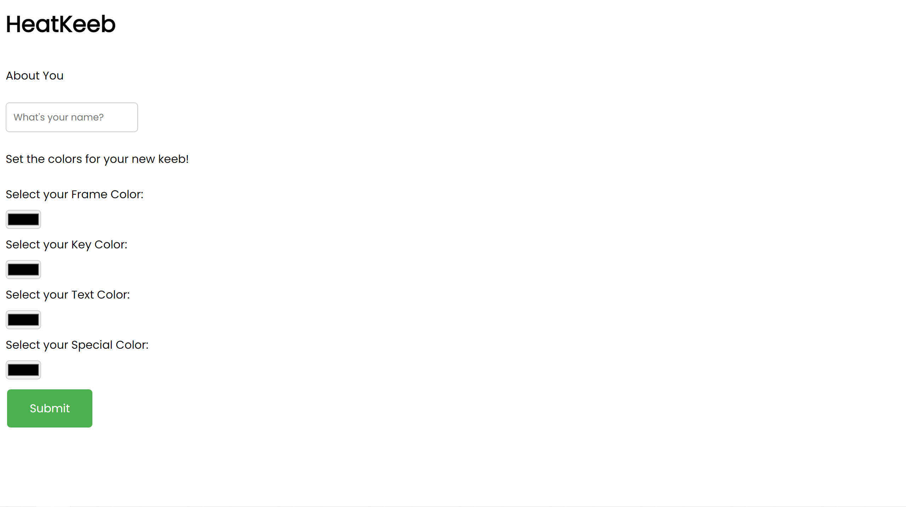

# HeatKeeb
---

> Description: Jaga had gained interest in custom keyboards and has created a platform to create your own keebs! We know we created his custom keeb on the 22nd of September 2022, at 09:41:17 SGT. Oddly specific but we know it's true.
>
> Difficulty: Easy
>
> Files: [heatkeeb.zip](./misc_heatkeeb.zip)

---

## Playing Around

This challenge features a website that allows you to build a keyboard, by setting the colours for different parts of the keyboard.



Upon building the keyboard, a token is returned which can then be used to access the menu.


In the menu, we can view the keyboard we created, or generate/view our heatmap.

The generate heatmap endpoint essentially takes in an input, and return a map which shows which keys were pressed.

An example of an `asd` keymap is as follows:


Finally, the last endpoint is to `test your text`, which basically, checks your input against the one you keyed in when generating the keymap.


## Looking through the code

The code is rather lengthy, but since we are only interested in finding our flag, we can grep for the function that returns a flag

```python
@app.post('/text')
def flag(request: Request, text: str = Form(...)):
    if 'token' in request.session:
        with shelve.open('keebdb') as db:
            token = request.session['token']
            if token in db:
                if token == ADMIN_TOKEN and text.upper() == KEY:
                    return templates.TemplateResponse("flag.html", {"request": request, "word": text, "flag": FLAG})
                elif text.upper() == db[token]['text']:
                    return templates.TemplateResponse("flag.html", {"request": request, "word": text})
    return templates.TemplateResponse("flag.html", {"request": request})

```

Essentially, the flag is returned if we have the **ADMIN** session token and we managed to guess the heatmap **text** in the `test your text` endpoint.

If we look at how the TOKEN is generated, 

```python
def build(request: Request, name: str = Form(...), frameColor: str = Form(...), keyColor: str = Form(...), textColor: str = Form(...), specialColor: str = Form(...)):
    t = datetime.datetime.now(pytz.timezone('Asia/Singapore'))
    seed = int(t.timestamp())
    random.seed(seed)
    token = ''.join(random.choices('abcdefghijklmnopqrstuvwxyzABCDEFGHIJKLMNOPQRSTUVWXYZ0123456789', k=16))

```

we can see that it uses a seed based off the current timestamp and uses it to generate a random token.

We have discussed how a python psuedo random number generator works in the writeup for [jagacha](../../CRYPTO/jagacha/README.md#understanding-rand).

Essentially, if we have the seed, we can generate the exact same random choice.

In the description of the challenge, it was mentioned that Jaga created his custom keyboard on the **22nd of September 2022, at 09:41:17 SGT**.

Using this, we can [generate the UNIX timestamp](https://gchq.github.io/CyberChef/#recipe=To_UNIX_Timestamp('Seconds%20(s)',true,true)&input=MjIgU2VwdGVtYmVyIDIwMjIgMDE6NDE6MTc) and use it as our seed to generate the admin token.

```python
import random
random.seed(1663810877)
print(''.join(random.choices('abcdefghijklmnopqrstuvwxyzABCDEFGHIJKLMNOPQRSTUVWXYZ0123456789', k=16)))
#OUTPUT: rMwwbpMkzAwyRoWs
```

Using this token, we can log into Jaga's keyboard menu.

Now all that's left is to figure out his secret text, which can be derived from looking at the heatmap.


which turns out to be `asertghnli`.

Using a word unscrambler, we can obtain the word `earthlings`, which gives us our flag.


