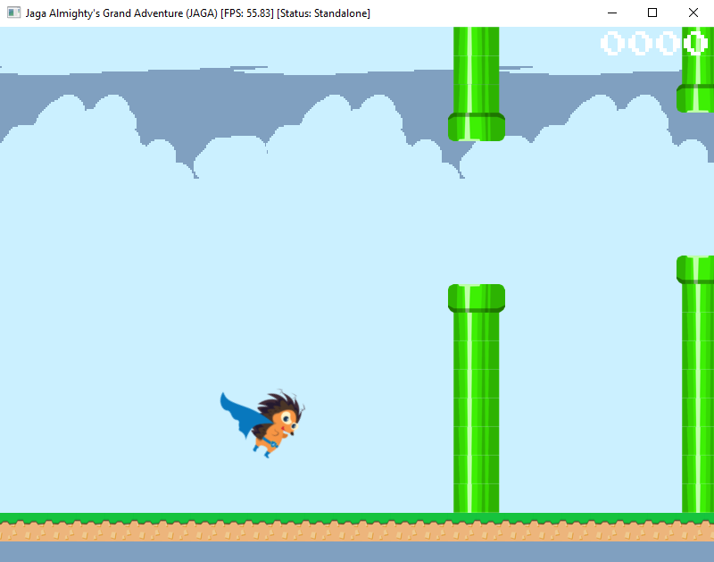
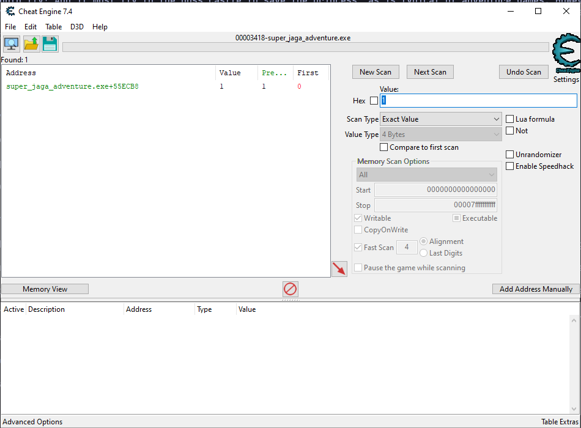
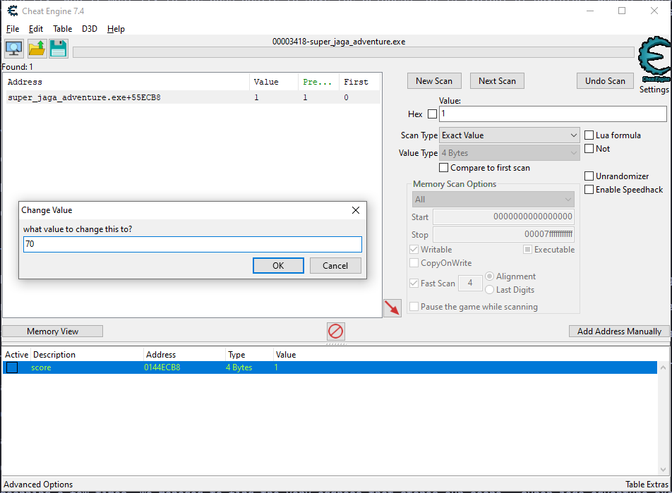
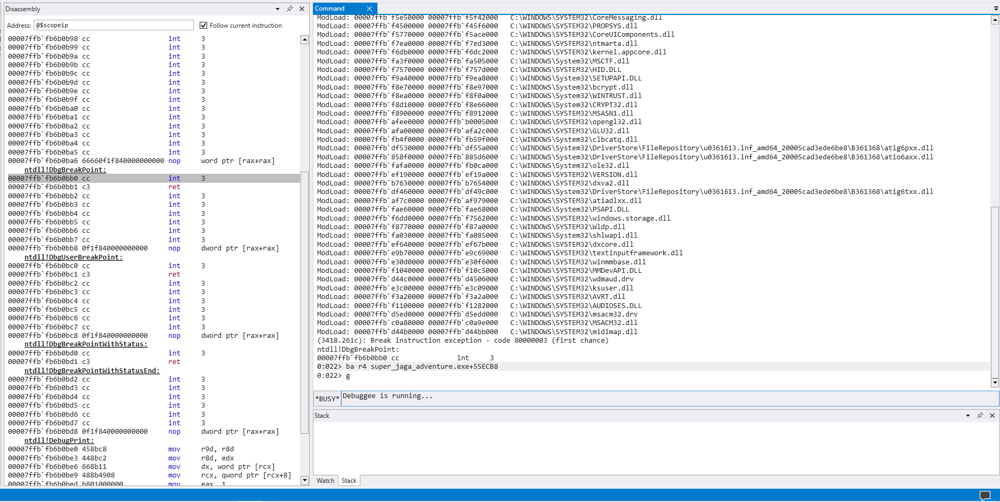
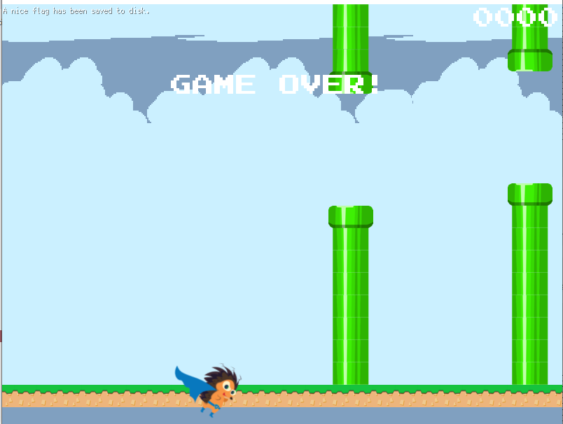

# Jaga Almighty's Grand Adventure
---

> Description: Jaga was returning from a nearby convenience store when it was suddenly summoned to a fantasy-like world of supernatural abilities and magic. Not long after arriving, Jaga discovered that it could fly! And it must fly to the boss castle to save the princess, as is typical of adventure games. However, the road ahead is paved with danger and pipes, and each time it hits a pipe, it is magically teleported to where he first spawned in the world! Could you help Jaga Almighty to navigate past at least 69 pipes?
>
> Difficulty: Medium
>
> Files: [super_jaga_adventure.exe](./super_jaga_adventure.exe)

---


## Playing Around

Running the game, we can see that it is essentially flappy bird but **flappy jaga**.

_p.s. picture taken in jaga last moments... rip jaga_ 




## Exploit Methodology

From the description, we can identify that we need to get past 69 pipes to solve the challenge. However, although it is possible, we do not want to go through hours of pain watching jaga die.

When trying to cheat games like this, what we want to do is to scan the entire memory of the program to find where the score is located at.

How this works is that, when we have a score of 0, we can scan the entire memory to look for 4 byte value of 0 and we will keep track of all the addresses that are returned.

We will then continue playing until we have a score of 1, and we will scan the addresses we found earlier, and look for the addresses that stores a value of 1, which will further narrow down our list.

Eventually, we should be able to find a single place in memory where the program is keeping track of the score. Then we can change this score and win the game.

## Execution 1

Now that we have the plan, we can try executing it with **Cheat Engine**.



After scanning a few times, we managed to find the very address that stores our score, `super_jaga_adventure.exe+55ECB8`.

Now we can double click the value to modify it to 70, and we should get the flag!



However, it does not seem to work. My guess is that the program validates the score in some way.

## Exploit Methodology 2

Simply modifying the score to a larger value does not work.

Let's think of it in another way:

If we put ourself in the shoes of the developer, we will have to retrieve the score to check if it is 69.

Thus we can just find the assembly instructions that check if the score is 69 and patch it accordingly.


## Execution 2

Let's pull out WinDBG and attach it to the game.

We can run the command `ba r4 super_jaga_adventure.exe+55ECB8` in WinDBG to let the debugger break when the program tries to read from `super_jaga_adventure.exe+55ECB8`.

We will then resume the debugger with `g`.



Upon resuming our program, we hit our first breakpoint at the following aseembly instructions.

```
0110c8e0 483935d1233400     cmp     qword ptr [144ECB8h], rsi 
0110c8e7 0f8da2050000       jge     000000000110CE8F            <-- Instruction Pointer
0110c8ed 4883fe45           cmp     rsi, 45h
0110c8f1 0f8c98050000       jl      000000000110CE8F
```

The first instruction above compares our score with RSI, and will jump if the score is greater or equal to RSI.

At this point, `RSI=0`. We can assume that this comparison is to check whether our score has changed.

This is also a feasible explaination for why directly changing the score at the specified memory does not work, since the score is greater than or equal to RSI, which seems to also contain the score. _(and is possibly used as a check to make it harder to directly tamper with the score in memory)_.

The third instruction then compares our score inside of **RSI** with 69, and branches accordingly.

From our understanding, if the score is more than or equals to 69, it will give us the flag. So this instruction seems to be where the check is being done.

So what we will do is to set a breakpoint at `0110c8e0`, and then set **RSI** to a value >= 69, and let the program resume.

```
0:018> ba r4 super_jaga_adventure.exe+55ECB8            # let the program break on access when it tries to read 4 bytes from specified memory
0:018> g                                                # resume the program
Breakpoint 0 hit
super_jaga_adventure+0x21c8e7:
00000000`0110c8e7 0f8da2050000    jge     super_jaga_adventure+0x21ce8f (00000000`0110ce8f) [br=1]
0:014> bp 0110c8e0                                      # break at the instruction mentioned above so we can modify rsi and change program flow
0:014> g                                                # resume the program
Breakpoint 0 hit
super_jaga_adventure+0x21ce96:
00000000`0110ce96 31c0            xor     eax,eax
0:014> g                                                # resume the program
Breakpoint 1 hit
super_jaga_adventure+0x21c8e0:
00000000`0110c8e0 483935d1233400  cmp     qword ptr [super_jaga_adventure+0x55ecb8 (00000000`0144ecb8)],rsi ds:00000000`0144ecb8=0000000000000000
0:013> r rsi=0x69                                       # modify our RSI to be a value >= 69
0:013> bd *                                             # disable all breakpoints
0:013> g                                                # resume the program
``````

After everything is done, we should see a message pop up on the screen at the top left



and the flag will be written to a `flag.bin` file in the same directory.

`STF22{iF_n0_s@vep0int_s@d_lIfE}`
