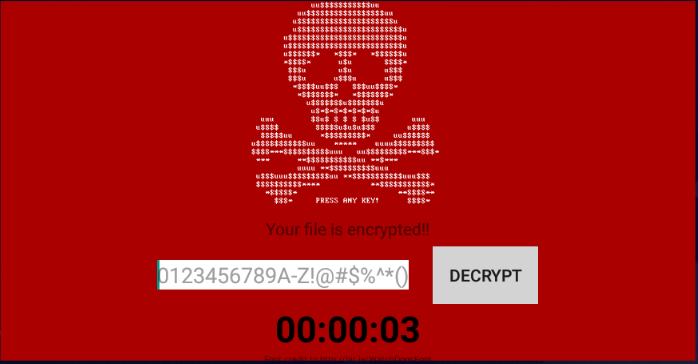

# Ransomware
---

> Jaga loves to download mobile games online. Oh no! Now Jaga's phone is infected with ransomware! Help Jaga to decrypt the necessary file!
> Difficulty: Easy
> Files: [ransomware.apk](./challenge2.apk)

---

## Playing around

If we run the APK in an android emulator, we are welcomed with a _beautiful_ ransomware screen.




## Reverse Engineering

We can throw the **APK** into a tool called `jadx-gui` which will decompile the **APK** into java code.

The first java class that catches our eye is `Deeecrypt` class which has the `doCryptoInAES` method.

```java
public class Deeecrypt {
    public static void doCryptoInAES(int i, String str, File file, File file2) throws CryptoException {
        try {
            SecretKeySpec secretKeySpec = new SecretKeySpec(str.getBytes(), "AES");
            Cipher cipher = Cipher.getInstance("AES");
            cipher.init(i, secretKeySpec);
            FileInputStream fileInputStream = new FileInputStream(file);
            byte[] bArr = new byte[(int) file.length()];
            fileInputStream.read(bArr);
            byte[] doFinal = cipher.doFinal(bArr);
            FileOutputStream fileOutputStream = new FileOutputStream(file2);
            fileOutputStream.write(doFinal);
            fileInputStream.close();
            fileOutputStream.close();
        } catch (IOException | InvalidKeyException | NoSuchAlgorithmException | BadPaddingException | IllegalBlockSizeException | NoSuchPaddingException e) {
            throw new CryptoException("Error encrypting/decrypting file", e);
        }
    }
}
```

Now that we have the decrypt function, we are looking for our encrypted flag and a key.

Since the **APK** doesn't have too much code, if we continue digging in the source code, we can quickly arrive at the `MyService.decryptFile` method

```java
    public void decryptFile(String str) throws IOException {
        String str2 = "/data/data/" + getPackageName() + "/flag.txt";
        String str3 = "/data/data/" + getPackageName() + "/flag_decrypt.txt";
        new File(str3).createNewFile();
        try {
            Deeecrypt.doCryptoInAES(2, str, new File(str2), new File(str3));
        } catch (CryptoException unused) {
            Toast.makeText(getApplicationContext(), "WRONG KEY", 0).show();
        }
    }

```

which decrypts a file called **flag.txt** and output it into **flag_decrypt.txt**.

Finally, if we look at the `Activities.onCreate` method, we can find the decryption key:

```java
    public void onCreate(Bundle bundle) {
        /* ...truncated... */
        edit.putString("key", "alberticipher123");
        /* ...truncated... */
    }

```

## Obtaining the flag

We can extract the `flag.txt` file from the APK with 7zip.

```sh
$ ls
challenge2.apk

$ 7z x challenge2.apk

7-Zip [64] 17.04 : Copyright (c) 1999-2021 Igor Pavlov : 2017-08-28
p7zip Version 17.04 (locale=en_US.UTF-8,Utf16=on,HugeFiles=on,64 bits,2 CPUs x64)

Scanning the drive for archives:
1 file, 3591534 bytes (3508 KiB)

Extracting archive: challenge2.apk

ERRORS:
Headers Error
Unconfirmed start of archive


WARNINGS:
There are data after the end of archive

--
Path = challenge2.apk
Type = zip
ERRORS:
Headers Error
Unconfirmed start of archive
WARNINGS:
There are data after the end of archive
Physical Size = 3533441
Tail Size = 58093
Characteristics = Local Minor_Extra_ERROR


Archives with Errors: 1

Warnings: 1

Open Errors: 1


$ fd flag.txt
assets/flag.txt

```

Now that we have everything we need, we can decrypt the file by throwing it into [**CyberChef**](https://gchq.github.io/CyberChef/#recipe=AES_Decrypt(%7B'option':'UTF8','string':'alberticipher123'%7D,%7B'option':'Hex','string':''%7D,'ECB/NoPadding','Raw','Raw',%7B'option':'Hex','string':''%7D,%7B'option':'Hex','string':''%7D)) _(cuz im lazy)_.

After decrypting the file, we obtain yet another java code.

```java
import java.util.Arrays;

public class Main {
    public static void main(String args[]) {
      String pt = "??????????????????????????????";
      String ct = "yu1gpulonjtqxn3ct6gkjxph";
      String ring1 = "abcdefghijklmnopqrstuvwxyz{}1234567890";
      String ring2 = "qw1234567890ertyuiopasdf{}ghjklzxcvbnm";
      int initial_shift = 3;
      int periodic_increment = 7;
      int periodic_length = 4;

      char[] ch = ring1.toCharArray();
      char[] ch_pt = pt.toCharArray();

      ring2 = shift(ring2, initial_shift);

      int temp_period = periodic_length;
      for (int i = 0; i < pt.length(); i++) {
          temp_period--;

          int index = new String(ch).indexOf(ch_pt[i]);
          ct = ct + ring2.charAt(index);
          if (temp_period == 0) {
              ring2 = shift(ring2, periodic_increment);
              temp_period = periodic_length;
          }
      }
    }

    public static String shift(String text, int shift) {
        for (int i = 0; i < shift; i++) {
            text = text.charAt(text.length() - 1) + text.substring(0, text.length() - 1);
        }
        return text;
    }
}
```

## Final Stretch

Since I'm lazy, we can use the newly released OpenAI ChatGPT to ask them to help us to brute force the flag.

I threw in the entire java code, and additionally gave OpenAI some instructions on what I want

> Can you convert the code above into a python encode function. The pt, aka plaintext, is what we are finding and it has the same length as the ct, ciphertext, which is what we want to obtain by encoding the plaintext. Write an additional brute force function by brute forcing the plaintext byte by byte while validating each byte to the corresponding byte in the ciphertext.

> Call the function brute_force with valid arguments

and OpenAI generated the following code.

```python

def encode(pt, ct, ring1, ring2, initial_shift, periodic_increment, periodic_length):
    ch = list(ring1)
    ch_pt = list(pt)

    ring2 = shift(ring2, initial_shift)

    temp_period = periodic_length
    for i in range(len(pt)):
        temp_period -= 1

        index = ch.index(ch_pt[i])
        ct = ct + ring2[index]
        if temp_period == 0:
            ring2 = shift(ring2, periodic_increment)
            temp_period = periodic_length
    return ct

def shift(text, shift):
    for i in range(shift):
        text = text[-1] + text[:-1]
    return text

def brute_force(pt, ct, ring1, ring2, initial_shift, periodic_increment, periodic_length):
    for i in range(len(pt)):
        for ch in ring1:
            pt[i] = ch
            encoded_ct = encode(pt, "", ring1, ring2, initial_shift, periodic_increment, periodic_length)
            if encoded_ct == ct:
                return pt
    return "Could not find a matching plaintext"

# Initialize the plaintext, ciphertext, and ring strings
pt = "??????????????????????????????"
ct = "yu1gpulonjtqxn3ct6gkjxph"
ring1 = "abcdefghijklmnopqrstuvwxyz{}1234567890"
ring2 = "qw1234567890ertyuiopasdf{}ghjklzxcvbnm"

# Initialize the initial shift, periodic increment, and periodic length
initial_shift = 3
periodic_increment = 7
periodic_length = 4

# Try to brute force the plaintext
brute_force_pt = brute_force(pt, ct, ring1, ring2, initial_shift, periodic_increment, periodic_length)
print(brute_force_pt)

```

After cleaning the code a little, we get

```python
def encode(pt, ct, ring1, ring2, initial_shift, periodic_increment, periodic_length):
    ch = list(ring1)
    ch_pt = list(pt)

    ring2 = shift(ring2, initial_shift)

    temp_period = periodic_length
    for i in range(len(pt)):
        temp_period -= 1

        index = ch.index(ch_pt[i])
        ct = ct + ring2[index]
        if temp_period == 0:
            ring2 = shift(ring2, periodic_increment)
            temp_period = periodic_length
    return ct

def shift(text, shift):
    for i in range(shift):
        text = text[-1] + text[:-1]
    return text

def brute_force(pt, ct, ring1, ring2, initial_shift, periodic_increment, periodic_length):
    for i in range(len(pt)):
        for ch in ring1:
            pt = list(pt)
            pt[i] = ch
            pt = ''.join(pt)
            encoded_ct = encode(pt, "", ring1, ring2, initial_shift, periodic_increment, periodic_length)
            if encoded_ct[i] == ct[i]:
                break
    return pt

# Initialize the plaintext, ciphertext, and ring strings
pt = "aaaaaaaaaaaaaaaaaaaaaaaa"
ct = "yu1gpulonjtqxn3ct6gkjxph"
ring1 = "abcdefghijklmnopqrstuvwxyz{}1234567890"
ring2 = "qw1234567890ertyuiopasdf{}ghjklzxcvbnm"

# Initialize the initial shift, periodic increment, and periodic length
initial_shift = 3
periodic_increment = 7
periodic_length = 4

# Try to brute force the plaintext
brute_force_pt = brute_force(pt, ct, ring1, ring2, initial_shift, periodic_increment, periodic_length)
print(brute_force_pt)
```

Running the script, we get the flag.

`stf22{c1ph4rsw1thatw15t}`
